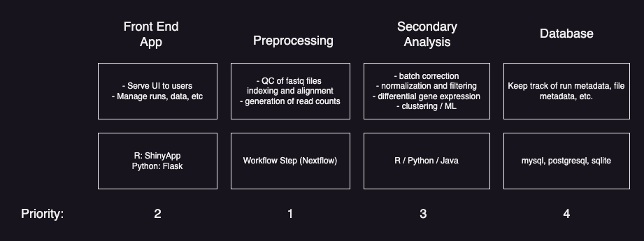

# ROT_WorkflowApp
This application will be used to run and manage bioinformatics workflows and downstream analysis

### Project Plan Overview

### Preprocessing
This application will process biological data using the Nextflow engine. We will start with basic RNASeq using fastq files as input and generating count data.  

The steps for going from raw fastq to processed counts and qc include:  
1. indexing of reference genome
2. qc of input fastq files
3. count generation using STAR/Kallisto

