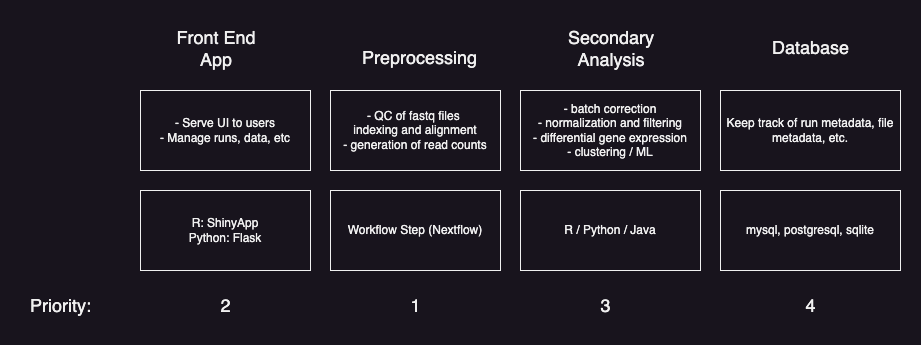

# ROT_WorkflowApp
This application will be used to run and manage bioinformatics workflows and downstream analysis

### Project Plan Overview



### Preprocessing
This application will process biological data using the Nextflow engine. We will start with basic RNASeq using fastq files as input and generating count data.  

The steps for going from raw fastq to processed counts and qc include:  
1. indexing of reference genome
2. qc of input fastq files
3. count generation using STAR/Kallisto


#### Bulk RNASEQ (PDiTomasso)

For this use case, we are going to use Paolo DiTomasso's slimmed down version of the RNAseq workflow. This workflow contains index, quant, and qc steps using salmon and fastqc (with multiqc for collection and reporting of qc output). To do some more custom count generation, we may also include a quant workflow step with bash processing of the raw fastq files.  

To run the rnaseq workflow, follow these steps:  
1. Pull the rnaseq-nf image using `./docker/rnaseq/pull.sh`  
2. Update params file to point to appropriate transcriptome files and fastq files  
3. Run the workflow with `./src/run_rnaseq.sh`  

Output will be sent to `src/results` with multiqc results contained in the html file and count results in the `src/results/quant` folder

#### Bulk RNASEQ (Custom)

This is a more bespoke, but less comprehensive version of the RNAseq workflow. It leverages samplesheet input, and a simple script for counting the number of unique reads in a sample. It may or may not do alignment depending on how far we get.  

**Samplesheet structure**
|sample_id|read1|read2|
|---------|-----|-----|
|sample001|001_R1.fastq.gz|001_R2.fastq.gz|
|sample002|002_R1.fastq.gz|002_R2.fastq.gz|
|...|...|...|
|sample00n|00n_R1.fastq.gz|00n_R2.fastq.gz|


### Flask Front End

> Hello user, which workflow would you like to run?

Upon selecting a workflow, the user should be presented with the workflow parameters to fill in. If the parameter is something like a samplesheet, they should then have the option to either create one manually by filling in a table, or upload the csv from a file browser. Unsure of the best way to provide a uniform UI across all different workflows, we will need to flesh that out as we go.  

We will use subprocess commands from app/utils.py as our workflow entrypoint rather than using bash scripts as we have for manual entry (src/run_rnaseq.sh). After selecting a workflow and populating the parameters, a `run_workflow()` will run like this:

```
def run_workflow(workflow, params_file):
    command = [
        "nextflow", "run", workflow,
        "-params-file", params_file,
        "-c", "nextflow.config"
    ]
    result = subprocess.run(command, capture_output=True, text=True)
    return result.stdout, result.stderr
```


